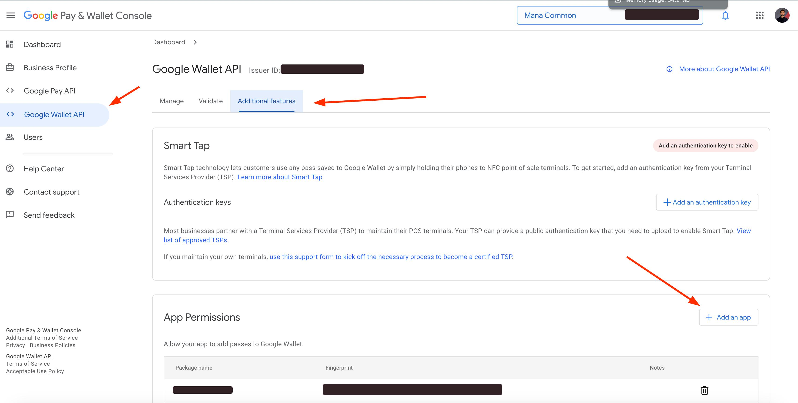

# react-native-google-wallet


## Installation

```sh
npm install react-native-google-wallet
```

## Setup

### Steps to Follow:

1. **Setting up Your Environment:**
   - Follow the instructions outlined in [Step 1](https://codelabs.developers.google.com/add-to-wallet-android#0) of the Google Pay API codelab to set up your development environment.
   
2. **Configuring Your Project:**
   - Proceed to [Step 2](https://codelabs.developers.google.com/add-to-wallet-android#1) to configure your Android project according to the provided guidelines.

### Creating a Generic Class:

- Following the initial setup, create a generic class within the [Google Pay Business Console](https://pay.google.com/business/console) or utilize the [Wallet Lab Tools](https://wallet-lab-tools.web.app/issuers) for temporary testing purposes. Once you've created your generic class, navigate to the Google Wallet API, click on "Additional Features", and add your app using the "Add an app" button as shown in the following photo:

   

### Additional Resources:

For further information on designing and implementing Google Wallet passes, consult the [Google Wallet Pass Builder documentation](https://developers.google.com/wallet/generic/resources/pass-builder).

## Usage

```js
import { addPass } from 'react-native-google-wallet';

// ...

const issuerEmail = "email@example.com";
const issuerId = "33880000000333999289";
const passClass = "33880000000333999289.4e5f8a07-2ef9-4d48-91a1-601c1d006db1";
const passId = Math.random().toString(36).substring(2, 15) + Math.random().toString(36).substring(2, 15); 

const newObjectJson = {
  iss: issuerEmail,
  aud: "google",
  typ: "savetowallet",
  iat: Math.floor(Date.now() / 1000),
  origins: [],
  payload: {
    genericObjects: [
      {
        id: `${issuerId}.${passId}`,
        classId: passClass,
        genericType: "GENERIC_TYPE_UNSPECIFIED",
        hexBackgroundColor: "#4285f4",
        logo: {
          sourceUri: {
            uri: "https://storage.googleapis.com/wallet-lab-tools-codelab-artifacts-public/pass_google_logo.jpg"
          }
        },
        cardTitle: {
          defaultValue: {
            language: "en",
            value: "Google I/O '22  [DEMO ONLY]"
          }
        },
        subheader: {
          defaultValue: {
            language: "en",
            value: "Attendee"
          }
        },
        header: {
          defaultValue: {
            language: "en",
            value: "Alex McJacobs"
          }
        },
        barcode: {
          type: "QR_CODE",
          value: passId
        },
        heroImage: {
          sourceUri: {
            uri: "https://storage.googleapis.com/wallet-lab-tools-codelab-artifacts-public/google-io-hero-demo-only.jpg"
          }
        },
        textModulesData: [
          {
            header: "POINTS",
            body: `${Math.floor(Math.random() * 10000)}`,
            id: "points"
          },
          {
            header: "CONTACTS",
            body: `${Math.floor(Math.random() * 99) + 1}`,
            id: "contacts"
          }
        ]
      }
    ]
  }
};

// Convertir el objeto a formato JSON
const newObjectJsonString = JSON.stringify(newObjectJson);


const result = await addPass(newObjectJsonString);
```

## Contributing

See the [contributing guide](CONTRIBUTING.md) to learn how to contribute to the repository and the development workflow.

## License

MIT

---

Made with [create-react-native-library](https://github.com/callstack/react-native-builder-bob)
```